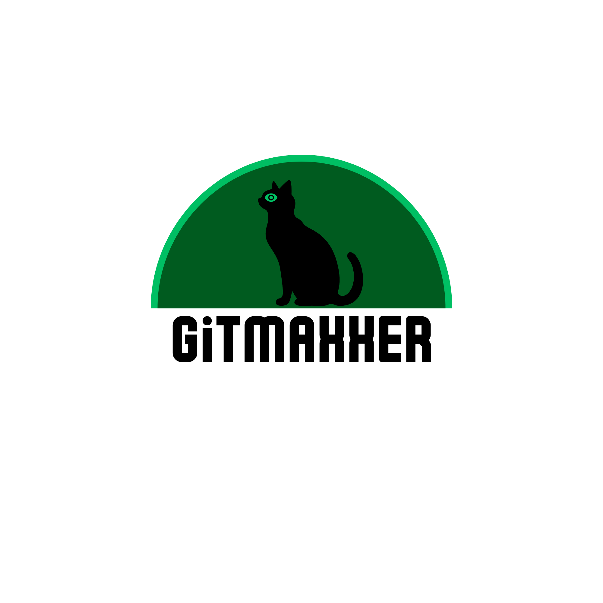

# GitMaxxer 

Automatically generate a large number of Git commits with controlled timestamps to populate your GitHub contribution graph.

## ⚠️ Disclaimer

This tool is for **educational and testing purposes only**. Using it to artificially inflate contribution graphs on public repositories may violate GitHub's Terms of Service. Use responsibly and only on repositories you own or have explicit permission to modify.

## Features

✅ Create hundreds of commits in seconds  
✅ Control commit distribution across time (by hour/day)  
✅ Set custom commit timestamps (bypass `GIT_AUTHOR_DATE`)  
✅ Dry-run mode to preview without changes  
✅ Configurable commit messages  
✅ Optional push to remote after generation  
✅ Cross-platform (Windows, macOS, Linux)  

## Requirements

- **Python 3.7+**
- **Git** (must be in your PATH)

## Installation

1. Clone or download this repository:
```bash
git clone https://github.com/IorranValenca/GitMaxxer.git
cd GitMaxxer
```

2. Ensure Python and Git are installed:
```bash
python --version
git --version
```

## Usage

### Basic Example

Generate 100 commits on today's date:
```bash
python gitmaxxer.py --repo "C:\path\to\your\repo" --commits 100
```

### Common Options

| Option | Default | Description |
|--------|---------|-------------|
| `--repo` | _(required)_ | Path to git repository (created if doesn't exist) |
| `--commits` | 100 | Number of commits to generate |
| `--date` | today | Date for commits (format: YYYY-MM-DD) |
| `--start` | 0 | Start hour (0-23) |
| `--end` | 23 | End hour (0-23) |
| `--name` | _(optional)_ | Git user name for this repo |
| `--email` | _(optional)_ | Git user email for this repo |
| `--file` | commit_log.txt | File to modify for each commit |
| `--message` | chore: automated commit | Commit message prefix |
| `--dry-run` | — | Preview actions without making changes |
| `--push` | — | Push to remote after generation |
| `--remote` | origin | Remote name to push to |
| `--branch` | main | Branch to push to |

### Examples

**Preview without making changes:**
```bash
python gitmaxxer.py --repo "C:\test-repo" --commits 50 --dry-run
```

**Create 200 commits spread over 9am-5pm:**
```bash
python gitmaxxer.py --repo "C:\my-repo" --commits 200 --start 9 --end 17
```

**Generate commits for a specific date:**
```bash
python gitmaxxer.py --repo "C:\my-repo" --commits 100 --date 2026-03-15
```

**Set user info and push to GitHub:**
```bash
python gitmaxxer.py --repo "C:\my-repo" --commits 150 --name "John Doe" --email "john@example.com" --push
```

**Custom commit messages:**
```bash
python gitmaxxer.py --repo "C:\my-repo" --commits 50 --message "feat: implement feature"
```

## How It Works

1. **Initialize or reuse a repo** at the specified path
2. **Generate timestamps** distributed across the specified date/hours with random jitter
3. **Create commits** by:
   - Appending a unique entry to a tracking file
   - Staging the file with `git add`
   - Committing with `GIT_AUTHOR_DATE` and `GIT_COMMITTER_DATE` set to fake historical timestamps
4. **Optionally push** to a remote repository

Each commit contains:
- A unique UUID for tracking
- The exact timestamp it was created at
- A configurable message prefix

## Stopping the Script

If the script is running and you want to stop it:

**Press `Ctrl + C`** to interrupt and cancel remaining commits.

## Troubleshooting

### Git not found
Ensure Git is installed and in your PATH:
```bash
git --version
```

### Permission denied (on macOS/Linux)
Make the script executable:
```bash
chmod +x gitmaxxer.py
```

### Remote push fails
Ensure:
- You have a remote configured: `git remote -v`
- You have push permissions to the remote
- Your Git credentials are configured

### Commits not appearing on GitHub
- GitHub only counts commits with the **email matching your account**
- Use `--email` with your GitHub email address
- Pushed commits only appear after `git push`

## Performance

- ~50 commits per second on average hardware
- Speed depends on system I/O and Git performance
- Use `--dry-run` to test before committing

## License

MIT License - Feel free to modify and distribute.

## Contributing

Found a bug or have a feature request? Open an issue!

---

**Use responsibly.** :-)
